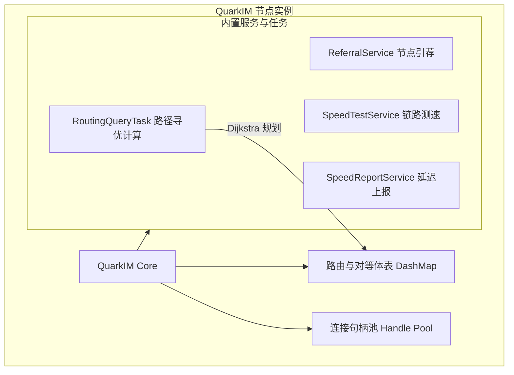
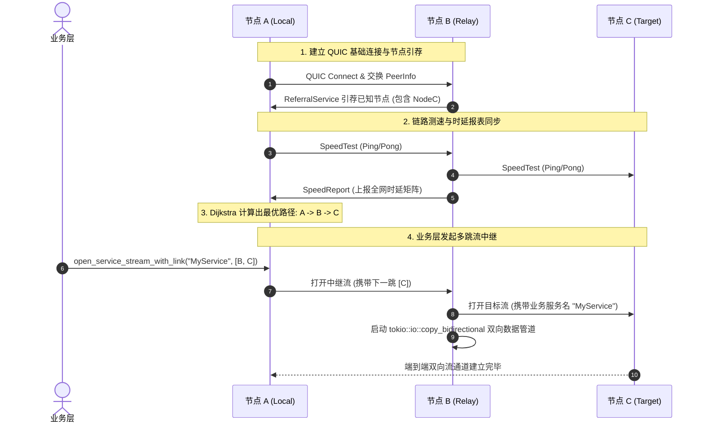

# QuarkIM

[](LICENSE)
[](https://www.rust-lang.org/)
[](https://github.com/aws/s2n-quic)

> **基于 Rust 与 QUIC 协议的高性能 P2P 实时通信、链路动态测速寻优与分布式流中继网络框架。**

QuarkIM 是一个面向分布式、边缘计算与去中心化实时交互场景的网络框架。底层基于 AWS `s2n-quic` 实现高性能、抗丢包的 QUIC 双向流通信，融合了对等体发现与引荐、分布式链路时延主动探测、基于 Dijkstra 算法的动态路径寻优，以及多跳透明双向流中继转发。

---

## 核心特性

- **🚀 QUIC 原生传输与多路复用**：基于 AWS `s2n-quic` 传输层，在单个 UDP 连接上并发复用多路双向流（Bidirectional Stream），自带 TLS 1.3 强安全加密与 0-RTT 建连恢复能力。
- **🌐 动态对等体发现与引荐（Referral）**：内置节点发现协议，节点加入后自动同步已知对等体并主动建立网状互联，实现自组织的去中心化拓扑。
- **⚡ 分布式链路测速与时延感知（Speed Probe）**：内置微秒级 Ping/Pong 主动测速（`SpeedTestService`）与全网时延指标广播聚合（`SpeedReportService`），实时感知网络拥塞与拓扑质量。
- **🧭 智能路由寻优与透明中继（Relay & Routing）**：集成 `pathfinding` 库的 Dijkstra 最短路径算法，结合节点跳数内部损耗加权模型，动态规划最优转发路径；当无法直连或链路劣化时，自动通过多跳节点透明中继（`tokio::io::copy_bidirectional`）完成端到端数据传输。
- **📦 高效紧凑的流编解码体系**：基于 MessagePack 与 `FramedStream` 异步帧处理器，兼顾极低序列化开销与类型安全。
- **🧩 插件化服务抽象与 Hook 机制**：提供 `Service` trait 与 `QuarkIMHook` 生命周期钩子，便于以非侵入方式扩展自定义业务协议与 RPC 处理逻辑。
- **📊 拓扑与路由状态可观测性**：内建轻量级 Axum HTTP 端点，实时输出当前节点拓扑表、延迟矩阵及中继最优路径。

---

## 系统架构与工作流

### 1. 节点内部架构



### 2. 节点互联、引荐与流转发流程



---

## 模块结构

```text
quark-im/
├── certs/                 # TLS 证书与自动化签发脚本
├── docs/                  # 架构设计与时序图说明
├── src/
│   ├── abstracts.rs       # 核心 Trait（Service, QuarkIMHook, PeerInfo 等）
│   ├── app_error.rs       # 统一错误与 Axum 响应封装
│   ├── framed_stream.rs   # 异步帧流包装器
│   ├── io_stream.rs       # 基础 I/O 流适配层
│   ├── lib.rs             # 库入口与模块导出
│   ├── message_pack.rs    # MessagePack 编解码封装
│   ├── negotiator.rs      # 流链路元数据协商器
│   ├── quark_im.rs        # QuarkIM 核心引擎与连接管理
│   ├── quic/              # QUIC 服务端与客户端构建逻辑 (s2n-quic)
│   ├── serde_framed.rs    # 序列化帧流工具
│   ├── services/          # 内置系统服务
│   │   ├── referral.rs      # 节点引荐服务
│   │   ├── speed_report.rs  # 时延报表聚合与同步服务
│   │   └── speed_test.rs    # 主动测速服务
│   ├── tasks/             # 后台任务
│   │   └── routing_query.rs # 基于 Dijkstra 算法的路径寻优任务
│   └── bin/               # 运行示例与集成测试
│       ├── z1.rs            # 基础 Echo 性能基准
│       ├── z2.rs            # 基于 FramedStream 的 MessagePack 示例
│       └── z3.rs            # 完整集群节点、路由计算与 HTTP 可观测服务
└── Cargo.toml             # 项目元数据与依赖配置
```

---

## 快速上手

### 1. 生成测试证书

本项目基于 QUIC 协议，通信需要有效证书支持：

```bash
cd certs
./generate_certs.sh
cd ..
```

### 2. 编译与检查

```bash
cargo check
```

### 3. 运行多节点集群示例

**启动种子节点（Node 1）：**

```bash
QUARK_SERVER_PORT=9001 cargo run --bin z3
```

- QUIC 端口：`9001`
- HTTP 观测端口：`9002`

**启动对等节点（Node 2，连接至 Node 1）：**

```bash
QUARK_SERVER_PORT=9003 QUARK_CONNECT_ENDPOINT=127.0.0.1:9001 cargo run --bin z3
```

- QUIC 端口：`9003`
- HTTP 观测端口：`9004`

**查看拓扑与路由信息：**

```bash
# 查看已知对等体列表
curl http://127.0.0.1:9002/routing

# 查看全网时延矩阵
curl http://127.0.0.1:9002/speed_report

# 查看计算出的最优中继路径
curl http://127.0.0.1:9002/relay_paths
```

---

## 技术栈

- **Language**：[Rust 2021](https://www.rust-lang.org/)
- **Async Runtime**：[Tokio](https://tokio.rs/)
- **QUIC Stack**：[AWS s2n-quic](https://github.com/aws/s2n-quic)
- **Concurrency**：[DashMap](https://github.com/xacrimon/dashmap), [Parking Lot](https://github.com/Amanieu/parking_lot)
- **Graph & Routing**：[Pathfinding (Dijkstra)](https://github.com/tforgione/pathfinding)
- **Serialization**：[RMP-Serde (MessagePack)](https://github.com/3rd-party/rmp-serde)
- **HTTP / Observability**：[Axum](https://github.com/tokio-rs/axum), [Tower](https://github.com/tower-rs/tower), [Tracing](https://github.com/tokio-rs/tracing)

---

## License

本项目遵循 [MIT](LICENSE) 许可证。
