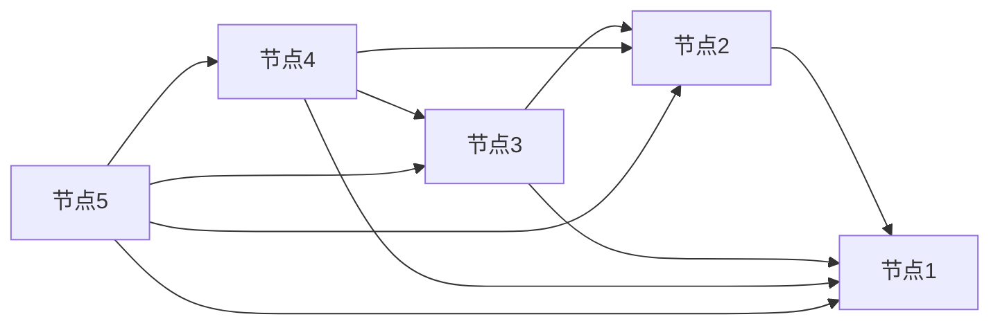
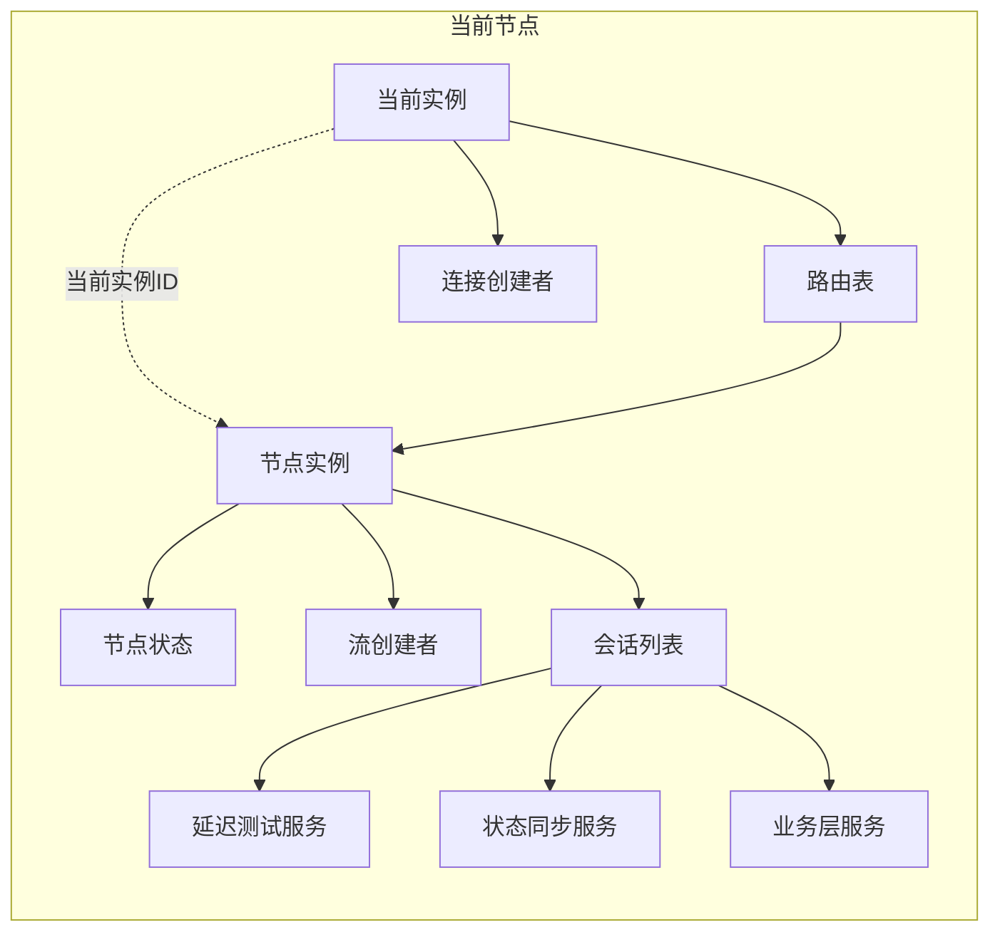

```mermaid
flowchart LR

    节点2 --> 节点1
    节点3 --> 节点1
    节点4 --> 节点1
    节点5 --> 节点1
    节点3 --> 节点2
    节点4 --> 节点2
    节点5 --> 节点2
    节点4 --> 节点3
    节点5 --> 节点3
    节点5 --> 节点4

```

- 成本估算
- 路径寻优
- 数据发送策略(单拨 组播 广播)
- 传输协议

```mermaid
flowchart LR

    subgraph 当前节点

        当前实例 -.->|当前实例ID| 节点实例
        当前实例 --> 路由表
        当前实例 --> 连接创建者

        路由表 --> 节点实例
        节点实例 --> 节点状态
        节点实例 --> 流创建者
        节点实例 --> 会话列表
        会话列表 --> 延迟测试服务
        会话列表 --> 状态同步服务
        会话列表 --> 业务层服务

    end

```
